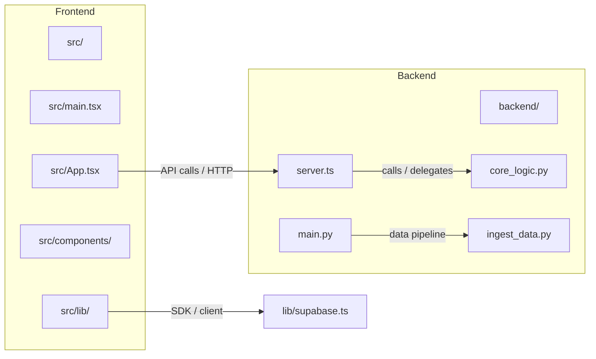

**Sơ đồ Frontend & Backend (thư mục dự án)**

Mục tiêu: mô tả cấu trúc và điểm tích hợp giữa phần Frontend và Backend trong workspace này.



**Tổng quan**
- Frontend: code React/TypeScript trong thư mục `src/` (entry: [src/main.tsx](src/main.tsx)).
- Backend: mã server và scripts ở gốc và `backend/` (ví dụ: [server.ts](server.ts), [main.py](main.py), [core_logic.py](core_logic.py)).

**Chi tiết Frontend**
- Entry / bootstrap: [src/main.tsx](src/main.tsx)
- Root component: [src/App.tsx](src/App.tsx)
- Các trang và component chính:
  - [src/components/LandingPage.tsx](src/components/LandingPage.tsx)
  - [src/components/Login.tsx](src/components/Login.tsx)
  - [src/components/dashboard/Workspace.tsx](src/components/dashboard/Workspace.tsx)
  - [src/components/dashboard/AIChat.tsx](src/components/dashboard/AIChat.tsx)
- Dữ liệu mẫu: [src/data/textbooks.ts](src/data/textbooks.ts)
- Thư viện tích hợp / API client:
  - [lib/api.ts](lib/api.ts)
  - [lib/supabase.ts](lib/supabase.ts)

**Chi tiết Backend**
- Node / TypeScript server: [server.ts](server.ts)
- Python scripts / dịch vụ: [main.py](main.py), [core_logic.py](core_logic.py), [ingest_data.py](ingest_data.py)
- Thư mục riêng cho backend: `backend/` (nội dung dự án backend cụ thể nằm ở đây)
- Các manifest / dependency:
  - [package.json](package.json)
  - [requirements.txt](requirements.txt)

**Điểm tích hợp (Integration Points)**
- Frontend gọi API tới `server.ts` (HTTP endpoints) để lấy/ghi dữ liệu và chức năng thời gian thực.
- `lib/supabase.ts` dùng để giao tiếp với Supabase (auth, database) từ frontend.
- Các script Python (`main.py`, `ingest_data.py`) xử lý ingest/ETL hoặc tác vụ nền; `core_logic.py` chứa logic chính.

**Lời khuyên vận hành (quick run)**
- Chạy frontend (nơi dùng Vite):

```bash
npm install
npm run dev
```

- Chạy backend Node (nếu cần):

```bash
npm run start # hoặc node server.ts / ts-node
```

- Môi trường Python:

```powershell
venv\\Scripts\\Activate.ps1
python main.py
```

**Các tệp quan trọng (quick links)**
- [src/App.tsx](src/App.tsx)
- [src/main.tsx](src/main.tsx)
- [src/components/](src/components/)
- [lib/api.ts](lib/api.ts)
- [lib/supabase.ts](lib/supabase.ts)
- [server.ts](server.ts)
- [backend/](backend/)
- [main.py](main.py)
- [core_logic.py](core_logic.py)

Nếu bạn muốn, tôi có thể:
- thêm sơ đồ chi tiết hơn cho từng phần (API endpoints, data flow),
- hoặc cập nhật README hiện tại để tích hợp phần này.
