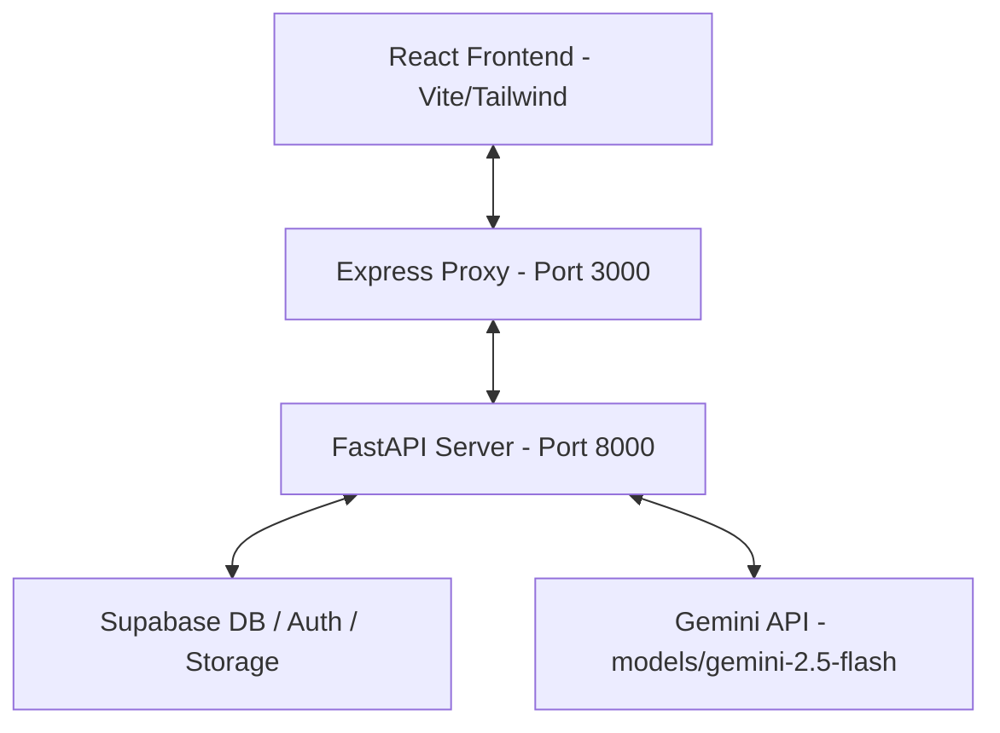

# 🎓 Gia Sư Ảo (Virtual Tutor) - Nền Tảng Học Tập Thông Minh Tích Hợp AI & Gamification

Nền tảng học tập thông minh giúp học sinh phổ thông tự học hiệu quả thông qua phương pháp sư phạm gợi mở Socratic kết hợp công nghệ Truy xuất dữ liệu tăng cường (RAG) từ sách giáo khoa chuẩn hóa và các yếu tố trò chơi hóa (Gamification) kích thích động lực học tập.

---

## 🚀 Tính năng nổi bật

### 1. Trò chuyện học tập thông minh (AI Chat System)
*   **Phương pháp Socratic:** AI không trực tiếp đưa ra câu trả lời cuối cùng mà đóng vai trò người dẫn đường, đưa ra các câu hỏi gợi mở, hướng dẫn học sinh tự suy duy và giải quyết bài toán.
*   **Công nghệ RAG (Retrieval-Augmented Generation):** Truy xuất thông tin thời gian thực từ kho sách giáo khoa chuẩn hóa (lớp 1 - 12) giúp triệt tiêu hiện tượng ảo giác (hallucination) của mô hình ngôn ngữ lớn (LLM).
*   **Hỗ trợ đọc đa tập sách (Multi-volume RAG):** Cơ chế truy xuất in-memory song song tối ưu hóa hiệu năng, cho phép hỏi và trả lời chéo nội dung giữa các tập sách (Ví dụ: Ngữ văn 12 Tập 1 và Tập 2) với độ trễ gần **0ms**.

### 2. Công cụ tự đánh giá cá nhân hóa (Quizzes & Flashcards Generator)
*   **Tạo bài tập tự động (AI Quiz Generator):** Tự động biên soạn các câu hỏi trắc nghiệm đa lựa chọn dựa trên chủ đề, độ khó được tùy chọn hoặc dựa trực tiếp trên nội dung tài liệu học sinh tải lên.
*   **Thẻ ghi nhớ thông minh (AI Flashcards):** Tự tạo thẻ ghi nhớ thuật ngữ, công thức giúp học sinh ôn tập nhanh và ghi nhớ dài hạn.

### 3. Trò chơi hóa & Cá nhân hóa học tập (Gamification & Personalization)
*   **Theo dõi tiến độ học tập (Study Tracker):** Thống kê thời gian tự học, hiển thị biểu đồ trực quan qua các ngày.
*   **Hệ thống XP & Cấp độ:** Tích lũy điểm kinh nghiệm (XP) qua các phiên học tập, làm quiz để tăng cấp (Level).
*   **Hệ thống Huy hiệu (Badges):** Tự động mở khóa các danh hiệu vinh danh dựa trên thành tích đạt được.

### 4. Khả năng tiếp cận toàn diện (Accessibility Features)
*   **Chuyển đổi văn bản thành giọng nói (Text-to-Speech):** Hỗ trợ đọc to câu hỏi và phản hồi của AI giúp tăng tương tác trực quan.
*   **Font chữ Dyslexia:** Hỗ trợ font chữ đặc thù giúp học sinh gặp hội chứng khó đọc dễ dàng tiếp cận kiến thức.

---

## 🛠️ Kiến trúc công nghệ (Architecture Stack)



### 1. Client (Frontend)
*   **Framework:** React 19 (Vite) + TypeScript.
*   **Styling:** Tailwind CSS cho giao diện hiện đại, mượt mà và tối ưu responsive trên mọi thiết bị di động.
*   **Libraries:** Motion (Hiệu ứng động), Recharts (Biểu đồ tiến độ), Lucide React (Bộ icon tối giản).

### 2. Server (Backend)
*   **API Engine:** Python FastAPI phục vụ luồng stream AI tốc độ cao qua SSE (Server-Sent Events).
*   **Database & Authentication:** Supabase (PostgreSQL) quản lý hồ sơ học sinh, tài liệu và lưu vết các phiên chat.
*   **AI Integration:** Bộ thư viện `@google/genai` tích hợp mô hình `gemini-2.5-flash` và `models/gemini-embedding-001` cho việc tạo vector trích xuất.

---

## ⚙️ Hướng dẫn cài đặt & Chạy dưới Local

### 1. Chuẩn bị biến môi trường
Tạo file `.env` tại thư mục gốc của dự án với các thông số cấu hình sau:
```env
SUPABASE_URL="https://your-project.supabase.co"
SUPABASE_KEY="your-anon-key"

# Cấu hình API Keys cho Gemini (Hỗ trợ cấu hình song song lên đến 6 keys để bypass rate limit)
GEMINI_API_KEY_1="your-gemini-key-1"
GEMINI_API_KEY_2="your-gemini-key-2"
GEMINI_API_KEY_3="your-gemini-key-3"
GEMINI_API_KEY_4="your-gemini-key-4"
GEMINI_API_KEY_5="your-gemini-key-5"
GEMINI_API_KEY_6="your-gemini-key-6"
```

### 2. Khởi chạy Backend (FastAPI Server)
1. Di chuyển vào thư mục dự án và kích hoạt môi trường ảo:
   ```bash
   # Windows:
   python -m venv venv
   venv\Scripts\activate
   ```
2. Cài đặt các thư viện Python:
   ```bash
   pip install -r requirements.txt
   ```
3. Khởi chạy server FastAPI trên cổng 8000:
   ```bash
   uvicorn api.main:app --host 127.0.0.1 --port 8000 --reload
   ```

### 3. Khởi chạy Frontend & Express Proxy
1. Cài đặt các gói thư viện Node.js:
   ```bash
   npm install
   ```
2. Khởi chạy Vite dev server trên cổng 3000:
   ```bash
   npm run dev
   ```
3. Truy cập nền tảng tại địa chỉ: [http://localhost:3000](http://localhost:3000)

---

## 📁 Cấu trúc thư mục dự án

```text
├── api/                   # Mã nguồn Python Backend (FastAPI)
│   ├── chunks_cache.json  # File cache vector RAG in-memory cho sách giáo khoa
│   ├── core_logic.py      # Logic cốt lõi RAG, Socratic Chat, Quiz & Flashcards
│   └── main.py            # Khởi tạo API Router, Auth Middleware và SSE Endpoints
├── src/                   # Mã nguồn Frontend (React)
│   ├── components/        # Các Component UI (Chat, Quiz, Flashcard, StudyTracker...)
│   ├── context/           # Quản lý State toàn cục (Auth, Theme, StudyStats)
│   └── App.tsx            # Điểm vào chính của ứng dụng React
├── server.ts              # Express Server Proxy hỗ trợ debug dưới Local
├── package.json           # Cấu hình dự án Node.js và Scripts khởi chạy
└── requirements.txt       # Danh sách thư viện Python cần thiết
```

---

## 💡 Đóng góp và Phát triển

Dự án được xây dựng và tối ưu liên tục nhằm mang lại giải pháp học tập an toàn, lành mạnh và hiệu quả nhất cho học sinh Việt Nam. Mọi thắc mắc và đóng góp vui lòng mở Issue hoặc Pull Request trên kho lưu trữ Github của dự án.
